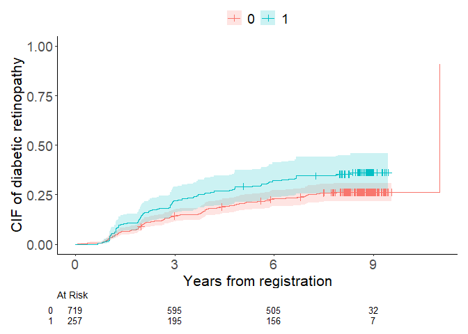

<!-- README.md is generated from README.Rmd. Please edit that file -->

# cif

<!-- badges: start -->

<!-- badges: end -->

The cif package provides a compact toolkit for survival and competing
risks analysis:

cif_curve() estimates and plots Kaplan–Meier survival or Aalen–Johansen
cumulative incidence curves using a unified interface, returning a
survfit-compatible object and (optionally) a publication-ready plot via
ggsurvfit.

cir_reg() performs competing risks (cumulative incidence) regression at
user-specified time points, focusing on multiplicative effect measures
(e.g., risk ratios / odds ratios / subdistribution hazard ratios), or
common effects over time like Cox regression and Fine-Gray models. A key
feature of this regression model is its ability to analyze multiple
competing events simultaneously while ensuring that the probabilities
sum to one. This is achieved by reparameterizing nuisance parameters
using polytomous log odds products. Additionally, cif_reg() supports
direct binomial regression for survival outcomes and the Richardson
model for binomial outcomes, both of which use log odds products.

The design goal is to keep the API familiar (formula + data), while
making high-quality default outputs (clean plots, interpretable
summaries) with minimal code.

## Installation

devtools::install_github(“gestimation/cif”)

## Quick overview

### What cif_curve() does

Estimation

outcome.type = “SURVIVAL” → Kaplan–Meier estimator with Greenwood-type
variance.

outcome.type = “COMPETING-RISK” → Aalen–Johansen estimator for the CIF
of event 1 using inverse-probability weighting for censoring. The
returned surv slot stores 1 − CIF for survfit compatibility.

Confidence intervals

Set the two-sided level via conf.int (default 0.95).

Choose the scale/transform via conf.type (default “arcsine-square
root”). Use “none”/“n” to suppress CI bands in plots.

Plotting

By default, the function draws a ggsurvfit plot including CI bands, a
risk table, censoring marks, and optional intercurrent-event marks you
specify per stratum.

To visualize CIF rather than survival, set ggsurvfit.type = “risk” (the
y-axis is then 1 - survival).

See ?cif_curve for details (arguments for labels, axis limits, theme,
legend position, etc.).

### What cir_reg() does

Target: effects on the cumulative incidence of an event of interest at
time t\* (or a vector of times).

Specification: a formula describing the outcome and covariates
(including strata() for censoring adjustment if needed). The exposure
can be categorical or continuous.

Effect measures: risk ratio (RR), odds ratio (OR), or subdistribution
hazard ratio (SHR) depending on your analysis plan.

Inference: returns point estimates, standard errors, CIs, and p-values;
exposes a tidy summary suitable for reporting (e.g., with modelsummary
or base summary()/print() methods).

## Model specification of cif_reg()

The model for cif_reg() is specified by three main components:

(1)Nuisance model: Describes the relationship between outcomes and
covariates (excluding exposure).

(2)Effect measures and time points: Defines the exposure effect to be
estimated and the time point of interest.

(3)Censoring adjustment: Specifies strata for inverse probability
weighting to adjust for dependent censoring.

### 1. Nuisance Model

The nuisance.model argument specifies the formula linking the outcome to
covariates. Its format depends on the outcome type:

(1)Competing risks or survival outcome: Use Surv() or Event() with time
and status variables.

(2)Binomial outcome: Use standard R formula notation.

Default event codes:

(1)Competing risks outcome: 1 and 2 for event types, 0 for censored
observations.

(2)Survival outcome: 1 for events, 0 for censored observations.

(3)Binomial outcome: 0 and 1.

Event codes can be customized using code.event1, code.event2, and
code.censoring. The outcome.type argument must be set to:

(1)Effects on cumulative incidence probabilities at a specific time:
‘COMPETINGRISK’

(2)Effects on a risk at a specific time: ‘SURVIVAL’

(3)Common effects on cumulative incidence probabilities over time:
‘POLY-PROPORTIONAL’

(4)Common effects on a risk over time: ‘PROPORTIONAL’

(5)Effects on a risk of a binomial outcome: ‘BINOMIAL’

Covariates included in nuisance.model should adjust for confounding
factors to obtain unbiased exposure effect estimates.

### 2. Effect measures and time points

Three effect measures available:

(1)Risk Ratio (RR)

(2)Odds Ratio (OR)

(3)Sub-distribution Hazard Ratio (SHR)

Set the desired measure using effect.measure1 and, for competing risks
analysis, effect.measure2. The time.point argument specifies the
follow-up time at which effects are estimated.

### 3. Censoring adjustment

Inverse probability weights adjust for dependent censoring. Use the
strata argument to specify stratification variables. If no strata are
specified, Kaplan-Meier weights are used.

## Output

The main components of the output list include:

(1)coefficient: Regression coefficients

(2)cov: Variance-covariance matrix

(3)diagnosis.statistics: Inverse probability weights, influence
functions, and predicted potential outcomes

(4)summary: Summary of estimated exposure effects

Use the summary output with msummary() to display formatted results. The
regression coefficients and their variance-covariance matrix are
provided as coefficient and cov, respectively, with the first element
corresponding to the intercept term, subsequent elements to the
covariates in nuisance.model, and the last element to exposure. Finally,
diagnosis.statistics is a dataset containing inverse probability
weights, influence functions, and predicted values of the potential
outcomes of individual observations.

## Example 1. Unadjusted competing risks analysis

For the initial illustration, unadjusted analysis focusing on cumulative
incidence probabilities of event 1 and 2 at 8 years is demonstrated.
Regression coefficients and variance covariance matrix of both exposure
(fruitq1) and covariates (intercept in this case) in the fitted direct
polytomous regression are presented.

``` r
library(cif)
data(diabetes.complications)
cif_curve(Event(t,epsilon) ~ fruitq1, data = diabetes.complications, outcome.type='C', error='delta', ggsurvfit.type = 'risk', label.y = 'CIF of diabetic retinopathy', label.x = 'Years from registration')
```



    #> Call: cif_curve(formula = Event(t, epsilon) ~ fruitq1, data = diabetes.complications, 
    #>     outcome.type = "C", error = "delta", ggsurvfit.type = "risk", 
    #>     label.x = "Years from registration", label.y = "CIF of diabetic retinopathy")
    #> 
    #>   records   n events median LCL UCL
    #> 0     720 719    189     11  NA  NA
    #> 1     258 257     92     NA  NA  NA

``` r
output <- cif_reg(nuisance.model = Event(t,epsilon) ~ +1, exposure = 'fruitq1', data = diabetes.complications,
          effect.measure1='RR', effect.measure2='RR', time.point=8, outcome.type='C', report.nuisance.parameter = TRUE)
print(output$coefficient)
#> [1] -1.38313159  0.30043942 -3.99147405  0.07582595
print(output$cov)
#>              [,1]         [,2]         [,3]         [,4]
#> [1,]  0.007502655 -0.004520362  0.003142563 -0.002206020
#> [2,] -0.004520362  0.009639432 -0.001175043  0.004587626
#> [3,]  0.003142563 -0.001175043  0.019007718 -0.016913815
#> [4,] -0.002206020  0.004587626 -0.016913815  0.054837284
```

The summaries of analysis results in the list of outputs
(e.g. output\$summary below) are in accordance with the format of model
summary function. All regression coefficients above are included in
summary by setting report.nuisance.parameter = TRUE. Model summary may
be used to converted to risk ratios, odds ratios or sub-distribution
hazards ratios using exponentiate=TRUE option. The summaries can be
displayed in Viewer with customized statistics such as p-values or
confidence intervals.

``` r
msummary(output$summary, statistic = c("conf.int"), exponentiate = TRUE)
```

<table style="width:97%;">
<colgroup>
<col style="width: 26%" />
<col style="width: 47%" />
<col style="width: 23%" />
</colgroup>
<thead>
<tr>
<th></th>
<th>event1</th>
<th>event2</th>
</tr>
</thead>
<tbody>
<tr>
<td>Intercept</td>
<td>0.251</td>
<td>0.018</td>
</tr>
<tr>
<td></td>
<td>[0.212, 0.297]</td>
<td>[0.014, 0.024]</td>
</tr>
<tr>
<td>fruitq1, 1 vs 0</td>
<td>1.350</td>
<td>1.079</td>
</tr>
<tr>
<td></td>
<td>[1.114, 1.637]</td>
<td>[0.682, 1.707]</td>
</tr>
<tr>
<td>effect.measure</td>
<td>RR at 8</td>
<td>RR at 8</td>
</tr>
<tr>
<td>n.events</td>
<td>279 in N = 978</td>
<td>79 in N = 978</td>
</tr>
<tr>
<td>median.follow.up</td>
<td>8</td>
<td><ul>
<li></li>
</ul></td>
</tr>
<tr>
<td>range.follow.up</td>
<td>[ 0.05 , 11 ]</td>
<td><ul>
<li></li>
</ul></td>
</tr>
<tr>
<td>n.parameters</td>
<td>4</td>
<td><ul>
<li></li>
</ul></td>
</tr>
<tr>
<td>converged.by</td>
<td>Converged in objective function</td>
<td><ul>
<li></li>
</ul></td>
</tr>
<tr>
<td>nleqslv.message</td>
<td>Function criterion near zero</td>
<td><ul>
<li></li>
</ul></td>
</tr>
</tbody>
</table>

## Example 2. Survival analysis

The second example is survival analysis (outcome.type=‘SURVIVAL’) to
estimate the effects on the risk of diabetic retinopathy at 8 years of
follow-up, treating macrovascular complications as censoring.

``` r
data(diabetes.complications)
diabetes.complications$d <- (diabetes.complications$epsilon>0)
output <- cif_reg(nuisance.model = Event(t,d) ~ +1, 
          exposure = 'fruitq1', strata='strata', data = diabetes.complications,
          effect.measure1='RR', time.point=8, outcome.type='SURVIVAL')
```

## Example 3. Competing risks analysis

The code below specifies direct polytomous regression of both of
competing events (outcome.type=‘COMPETINGRISK’). 15 covariates and
censoring strata are specified in nuisance.model= and strata=,
respectively.

``` r
output <- cif_reg(nuisance.model = Event(t,epsilon) ~ age+sex+bmi+hba1c+diabetes_duration
          +drug_oha+drug_insulin+sbp+ldl+hdl+tg+current_smoker+alcohol_drinker+ltpa, 
          exposure = 'fruitq1', strata='strata', data=diabetes.complications,
          effect.measure1='RR', time.point=8, outcome.type='COMPETINGRISK')
```

Only the regression coefficient of exposure is included in summary, so
now model summary does not display parameters of the covariates other
than exposure.

``` r
msummary(output$summary, statistic = c("conf.int"), exponentiate = TRUE)
```

<table style="width:97%;">
<colgroup>
<col style="width: 26%" />
<col style="width: 47%" />
<col style="width: 23%" />
</colgroup>
<thead>
<tr>
<th></th>
<th>event1</th>
<th>event2</th>
</tr>
</thead>
<tbody>
<tr>
<td>fruitq1, 1 vs 0</td>
<td>1.552</td>
<td>0.909</td>
</tr>
<tr>
<td></td>
<td>[1.331, 1.810]</td>
<td>[0.493, 1.676]</td>
</tr>
<tr>
<td>effect.measure</td>
<td>RR at 8</td>
<td>RR at 8</td>
</tr>
<tr>
<td>n.events</td>
<td>279 in N = 978</td>
<td>79 in N = 978</td>
</tr>
<tr>
<td>median.follow.up</td>
<td>8</td>
<td><ul>
<li></li>
</ul></td>
</tr>
<tr>
<td>range.follow.up</td>
<td>[ 0.05 , 11 ]</td>
<td><ul>
<li></li>
</ul></td>
</tr>
<tr>
<td>n.parameters</td>
<td>32</td>
<td><ul>
<li></li>
</ul></td>
</tr>
<tr>
<td>converged.by</td>
<td>Converged in objective function</td>
<td><ul>
<li></li>
</ul></td>
</tr>
<tr>
<td>nleqslv.message</td>
<td>Function criterion near zero</td>
<td><ul>
<li></li>
</ul></td>
</tr>
</tbody>
</table>
